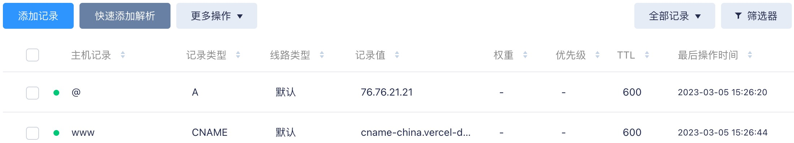

#### 注明
本文章使用chatGPT辅助编写。

### 1. 简介
Vercel 是一个云平台，用于部署和托管 Web 应用程序和网站。它成立于 2015 年，旨在让开发人员快速、高效地部署项目。

Vercel 提供了许多功能，使其成为开发人员的热门选择，包括：

- 简单部署：Vercel 支持各种部署选项，包括 Git、GitHub 和其他流行的版本控制系统。这使得开发人员可以轻松部署他们的代码，而无需担心设置服务器或管理基础设施。

- 可扩展性：Vercel 被设计为自动扩展，因此您的应用程序可以处理流量峰值，而无需任何停机时间或性能问题。

- 无服务器函数：Vercel 支持无服务器函数，使开发人员可以按需运行代码，而无需担心管理服务器或基础设施。

- 分析和监控：Vercel 提供了详细的分析和监控工具，因此您可以跟踪应用程序的性能并识别需要解决的任何问题。

总的来说，Vercel 是一个功能强大、用户友好的平台，可以帮助开发人员快速、轻松地部署和托管他们的 Web 应用程序。

>博主只是将其用来搭建个人博客网站，属于是大材小用了。

### 2. 使用Vercel CLI
Vercel CLI 是 Vercel 公司提供的命令行工具，它可以让开发人员在本地开发和测试他们的应用程序，并使用 Vercel 平台进行部署和托管。

#### 2.1 创建一个Github私有仓库
步骤略。
>私有是为了避免博客文章被有心人直接Copy源文件进行剽窃。

#### 2.2 使用Hexo框架
Hexo 是一个基于 Node.js 的静态博客框架，它可以帮助用户快速创建和部署静态博客网站。

使用 Hexo，用户可以使用 Markdown 语法来编写文章和页面，并使用主题和插件来自定义网站的外观和功能。Hexo 还支持多种部署方式，包括 GitHub Pages、Netlify 和 Vercel 等平台。

如下命令在本地安装hexo（请首先确保环境已安装NodeJS）：
```shell
cd your_github_repo/
npm install -g hexo
hexo -v # check version
```

#### 2.3 使用Vercel CLI
```shell
# 安装
npm install -g vercel

vercel login    # 跳转到浏览器登录，再回到CLI
vercel init     # 初始化环境，调整上下键选择hexo环境，并填入一些信息（含博客项目名），回车
```
然后可以在仓库下看到`hexo`名称的目录被创建，并且里面创建好了hexo的目录结构。

#### 2.4 开始部署
输入`vercel`命令并回车，根据提示输入你的选择（可参考博主的操作）：
```shell
lei@WilldeMacBook-Pro hexo % vercel
Vercel CLI 28.16.12
❗️  Your Project was either deleted, transferred to a new Team, or you don’t have access to it anymore.
? Set up and deploy “~/Desktop/Rust/LeiggBlogs/hexo”? [Y/n] y
? Which scope do you want to deploy to? chasespace
? Link to existing project? [y/N] n
? What’s your project’s name? leigg
? In which directory is your code located? ./
Local settings detected in vercel.json:
Auto-detected Project Settings (Hexo):
- Build Command: hexo generate
- Development Command: hexo server --port $PORT
- Install Command: `yarn install`, `pnpm install`, or `npm install`
- Output Directory: public
? Want to modify these settings? [y/N] n
🔗  Linked to chasespace/leigg (created .vercel)
🔍  Inspect: https://vercel.com/chasespace/leigg/DgH3fzUU5eS7ATofMSJ8zC5H8oKp [2s]
✅  Production: https://leigg.vercel.app [16s]
📝  Deployed to production. Run `vercel --prod` to overwrite later (https://vercel.link/2F).
💡  To change the domain or build command, go to https://vercel.com/chasespace/leigg/settings
```
>如果报错`yarn...`，就删除hexo/下的yarn.lock并重新初始化yarn环境（Vercel需要）:   
> `npm install -g yarn`  
> `yarn install`

根据最后的提示，部署成功后会产生一次部署记录（Inspect项），一个访问域名（Production项），这些信息可以在Vercel官网的仪表盘中的项目详情页中看到。
通过访问域名可以看到刚才部署的博客页面的，需要注意的是，Vercel域名由于在国内存在dns污染导致无法访问，需要单独购买域名并指向Vercel服务器IP，当前只能挂代理访问。

在项目详情页中点击`View Build Logs`查看构建记录，点开`Deployment status`->`Building`查看部署日志。并且在当前页面的顶部存在一些按钮：
- logs：Vercel提供的这个网站项目的runtime日志，主要包括网站的请求日志；
- source：查看**本次部署**的网站源文件(Source)和编译后的网站静态文件（Output）;

#### 2.5 更新博客
比如修改文章、添加/删除文章或修改配置等，都需要再次发布，这里也很简单，都不需要使用hexo命令，而是直接执行`vercel --prod`命令即可（偶尔存在失败的情况，多试几次，据博主测试不需要代理）。

#### 2.6 解决国内无法访问的问题
前面说过，Vercel域名在国内由于DNS污染问题导致无法访问，需要绑定其他域名。博主使用的是腾讯云服务（购买需实名），购买后在DNS解析页面配置两条记录：



>CNAME记录的地址是 cname-china.vercel-dns.com

然后在Vercel的项目的`Settings`->`Domains`中添加新域名。关于本节中不清楚的内容可以参考这篇 [知乎文章](https://zhuanlan.zhihu.com/p/595448121) 中的域名绑定部分。

#### 2.7 其他
注意几点：
- 上传文章后，同时将文件上传至Github仓库托管（以免本机故障导致数据丢失）。